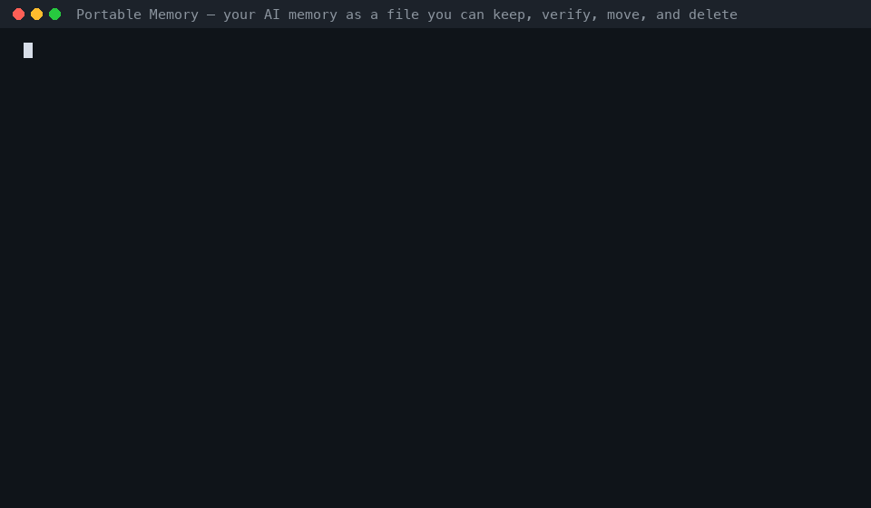

# Portable Memory

**An open, vendor-neutral format and protocol for carrying AI memory across apps, devices, and vendors — losslessly, locally, and verifiably governed.**

AI assistants are starting to *remember* — your preferences, your projects, your history across sessions. Portable Memory is an open, vendor-neutral format for that memory — proposed and stewarded in the open (see [GOVERNANCE](GOVERNANCE.md)): a `.mem` bundle is a plain folder of JSONL files + a manifest + checksums that any tool can read, verify, transfer, and merge. No server, no lock-in, no proprietary blob.

```text
your-memory.mem/
  manifest.json     items/episode.jsonl     audit/tombstones.jsonl     CHECKSUMS
```

> 📄 **Read the paper:** [*Memory Belongs to the User: Portable Memory, an Open Standard Proposal for Cross-Vendor AI Memory*](https://research.macpaw.com/publications/portable-memory) — the vision, the design, the evidence, and an open invitation to collaborate (MacPaw Research, 2026). See [Citation](#citation).

## Try it in 60 seconds

Your AI memory is already portable enough to *paste*: every assistant now hands you a prompt that dumps it as text (Claude's and Gemini's import pages give you the standard one — *"Format each entry as: [date saved, if available] - memory content"*). Portable Memory turns that lossy text into something you can keep, verify, merge, and delete:



```swift
import PortableMemory

// The code block an assistant returned for the standard memory-export prompt:
let text = try String(contentsOfFile: "export.txt", encoding: .utf8)
let episodes = TransferTextAdapter.parseEpisodes(text, source: "chatgpt")
// → deterministic, deduplicated episodes (date, section, and line preserved in metadata).
//   Feed them to your `PortableMemoryStore` and `BundleExporter` for a verifiable .mem bundle, or
print(TransferTextAdapter.renderText(episodes))   // paste-ready text for Claude's or Gemini's memory import
```

Same text in, **byte-identical** bundle out — in Swift *and* Python ([`Conformance/fixtures/transfer/`](Conformance/fixtures/transfer) is the proof). Prefer a command line? The Python SDK ships one: `pip install portable-memory && mem paste export.txt --out my-memory.mem`.

---

## Why this exists

Today, the memory an assistant builds up about you is **trapped**. Every product stores it in its own private shape, in its own database, on its own servers:

- **You can't move it.** Switch assistants or devices and you start from zero — years of context, gone.
- **There's no shared meaning.** One vendor's "memory" is a text blob, another's is a graph, a third's is a chat log. Nothing speaks to anything else.
- **You can't prove it's deleted.** Ask to forget something and it may linger in a vector index, an embedding cache, a knowledge graph, or a backup replica. "Deleted" is a promise, not a guarantee.

This is the data-portability gap of the AI era — the same gap the web closed for documents, mail, and calendars with open formats. Memory is more personal and higher-stakes, and it deserves the same: **a format you own, that moves with you, and that deletes when you say so.**

## What you get

| For people | For builders | For the industry |
|---|---|---|
| **Own your memory.** Export it, keep a local copy, move it between assistants and devices. | **Adopt, don't reinvent.** Implement one small protocol and exchange memory with any other adopter. | **No lock-in.** A neutral, local-first alternative to N proprietary silos. |
| **Real deletion.** A delete propagates to *every* derived copy, with a recorded proof-of-reach you can verify (supports GDPR / EU AI Act erasure). | **Trust & compliance for free.** Inherit verifiable deletion, an audit trail, and an Evidence Pack you can hand to a compliance team. | **An ecosystem.** Interop is the substrate for portable, composable AI memory. |
| **Inspect it.** Plain text + checksums — open it in any editor. | **Lossless on-ramp.** Unknown record kinds round-trip verbatim and unknown fields on episodes ride along as `ext`, so adopting never costs you data (every kind: [RFC-0002](Spec/rfcs/0002-ext-for-all-kinds.md)). | **A conformance bar.** A badge that *means* something, gated on the hardest guarantee. |

## What makes it trustworthy

Three properties set this apart from "just another export schema":

1. **Verifiable deletion is the headline, not a footnote.** A deletion is a first-class, portable **tombstone** that propagates to every artifact derived from the content — indexes, vectors, caches, graph edges, replicas — and records *proof of what was removed*. The conformance badge is **gated on this** (level L2): you must prove a deleted item is unreachable via every retrieval route, not merely "removed from a table."
2. **Lossless superset, not a lowest common denominator.** A memory can move *into* the standard and back out — or between two vendors — without losing what the format doesn't model: entire vendor-specific record kinds round-trip **verbatim**, and fields the standard doesn't model on an episode — the atomic memory — are preserved as `ext`. Extending `ext` carriage to every record kind is proposed in [RFC-0002](Spec/rfcs/0002-ext-for-all-kinds.md).
3. **Local-first and inspectable.** A bundle is a self-contained directory of JSONL + a manifest + a `CHECKSUMS` file. No server is needed to read, verify, or transfer it; source text is the portable truth and embeddings are an optional, model-tagged accelerator the receiver re-derives — so a bundle is never tied to one embedding model.

### Design principles

Vendor-neutral · local-first · lossless round-trip · **governed** (deletions propagate, carry proof-of-reach, and are verifiable when signed) · engine-agnostic (source text is authoritative) · auditable (every mutation logged).

---

## How it works

The format is a `.mem` bundle; the protocol is one Swift protocol you implement.

```text
mybundle.mem/
  manifest.json            format version, capabilities, model tags, counts, integrity
  items/<kind>.jsonl       episode, entity, edge, fact, resource, chunk, core, procedure,
                           context, community, category, preference, secretRef (+ vendor kinds)
  embeddings/              OPTIONAL, model-tagged; receiver may ignore and re-embed
  audit/log.jsonl          every mutation (provenance trail)
  audit/tombstones.jsonl   deletions + redactions — applied FIRST on import
  CHECKSUMS                sha256 per file
```

Implement `PortableMemoryStore` — map your store to/from the portable record DTOs. The SDK owns the format (bundle I/O, manifest, checksums, deterministic JSONL, **tombstone-first** import ordering, `--since` filtering, `ext`/passthrough, path-safety). You own persistence and re-deriving your own indexes/embeddings on import. Every requirement has a default (empty read / no-op write), so you override **only the kinds you support** — a store with just episodes implements two methods, not thirty.

```swift
struct MyStore: PortableMemoryStore {
    func exportEpisodes() async throws -> [PortableEpisode] { /* map your rows */ }
    func importEpisode(_ e: PortableEpisode, ext: String?) async throws { /* upsert by id */ }
    // …override the kinds you have; the rest default to no-op.
}

let manifest = try await BundleExporter().export(MyStore(), to: bundleURL)         // write a .mem
let report   = try await BundleImporter().importBundle(MyStore(), from: bundleURL)  // merge one in
let result   = BundleValidator().validate(bundle: bundleURL)                        // L0 check
```

Ingest another vendor's export with an adapter (mem0, ChatGPT, and Claude ship in the box):

```swift
var episodes = try Mem0Adapter.parseEpisodes(Data(contentsOf: mem0ExportURL))       // mem0
episodes += try OpenAIAdapter.parseEpisodes(Data(contentsOf: conversationsURL))     // ChatGPT data export
episodes += ClaudeAdapter.parseEpisodes(files: [                                    // Claude memory files
    (path: "memory/MEMORY.md", content: memoryIndexText),
])
```

## Deletion propagation — the trust core

This is the guarantee the whole standard rests on. A `delete` (or `redact`, for erasure) must reach **everything** derived from the content, and an import must apply tombstones **before** additions — so a bundle that still ships the stale rows can never resurrect deleted content. The tombstone carries the proof-of-reach (the ids of every artifact removed), which is exactly what an Evidence Pack turns into a compliance artifact.

## Conformance levels

| Level | Requirement |
|---|---|
| **L0** | Read / Export — a valid, checksum-clean bundle |
| **L1** | Import / Merge — lossless, idempotent, bi-temporal merge |
| **L2** | **Deletion propagation** — honors tombstones across all derived artifacts (**the badge**) |
| **L3** | Governed — full audit trail, Evidence Pack, signed tombstones |

## Cross-vendor interoperability

The format is a superset container that absorbs other providers' memory without loss:

| `.mem` | mem0 | OpenAI / ChatGPT | Anthropic / Claude | Letta |
|---|---|---|---|---|
| `episode` | a memory | a saved memory / turn | a memory-tool entry | archival/recall message |
| `core` | — | profile | persona/project notes | core memory block |
| `entity` / `edge` / `fact` | graph relations | derive on import | derive on import | — |

What a source doesn't model rides in via `ext` (fields) and passthrough (kinds); new adapters map what's modeled and preserve the rest. Full mapping in the spec §10.

---

## Install

```swift
.package(url: "https://github.com/MacPaw/portable-memory-swift.git", from: "0.2.0")
```

```swift
import PortableMemory
```

Dependency-light (only [swift-crypto](https://github.com/apple/swift-crypto)), so it builds on Apple platforms **and** Linux.

## What's in this repo

| | |
|---|---|
| 📦 **`Sources/PortableMemory/`** | The Swift reference SDK — format types, DTOs, the `PortableMemoryStore` seam, `BundleExporter` / `BundleImporter` / `BundleValidator`, tombstones, and the mem0 adapter. |
| 📄 **[`Spec/portable-memory-spec.md`](Spec/portable-memory-spec.md)** | The language-neutral specification (v1.0). |
| 🧬 **[`Schemas/`](Schemas)** | JSON Schemas — validate `manifest.json` and each record kind in **any** language, no SDK required. |
| ✅ **[`Conformance/`](Conformance)** | The L0–L3 checklist, the deletion-propagation probe, and a sample `.mem` fixture. |

**Status:** spec v1.0; this is the **Swift** reference SDK. A byte-interoperable **[Python SDK](https://github.com/MacPaw/portable-memory)** shares the same format, spec, and schemas. Anyone — any vendor, any language — is welcome to implement the spec and the JSON Schemas; the goal is for the standard to grow *outward* across the ecosystem.

## FAQ

**Is my memory encrypted inside a `.mem` bundle?**
The bundle is plain JSONL *by design* — inspectable and vendor-neutral. Encryption is an envelope concern: encrypt the bundle at rest or in transit with whatever you already use (e.g. age, GPG, an encrypted archive). The format never weakens that; it just doesn't reinvent it.

**What about secrets / API keys / credentials?**
They are **never** exported as plaintext *or* ciphertext. A `secretRef` carries only the metadata skeleton (label, category, sensitivity, encryption metadata); the encrypted value stays in the originating vault unless an explicit, authorized, encrypted transfer is negotiated.

**What happens to embeddings across different models?**
Source text is the portable truth; embeddings are an optional, model-tagged accelerator. A receiver reuses vectors only if its model tag matches exactly — otherwise it re-embeds from text. The reference SDK doesn't inline vectors at all, so **a bundle is never tied to one embedding model.**

**Do I have to support every record kind?**
No. Every method on `PortableMemoryStore` has a default (empty read / no-op write), so you implement only the kinds you actually have — a store with just episodes overrides two methods.

**What if a bundle has fields or kinds my engine doesn't understand?**
They survive untouched. Unknown fields on an episode are preserved in `ext`; entire unknown record kinds round-trip **verbatim**. Importing another vendor's bundle and re-exporting drops nothing — that's what "lossless superset" means.

**How are merges and conflicts handled?**
Import is **merge-by-id and idempotent** — re-importing the same bundle is a no-op. Bi-temporal facts and edges **supersede rather than overwrite** (both rows kept, validity windows set), so history is preserved and a point-in-time (`as_of`) view reconstructs any past state.

**How do I claim a conformance level?**
Run the [`Conformance/`](Conformance) checklist. **L0**: the validator passes on your export. **L1**: export → import reproduces the store and a second import is a no-op. **L2** (the badge): pass the deletion-propagation probe — a deleted item is unreachable via every route *and* a tombstone was written. **L3**: full audit trail + Evidence Pack + signed tombstones.

**Why is *deletion* the conformance gate, of all things?**
Because it's the hardest guarantee and the one people actually test. A memory layer that can't prove a delete is gone *everywhere* — vector index, cache, graph, replica — is a liability the moment a user checks. Gating the badge on it makes the badge mean something.

**Is this Swift-only / Apple-only?**
No. The format and protocol are language-neutral (see [`Spec/`](Spec) + [`Schemas/`](Schemas) — validate in any language). This repo is the Swift reference SDK, and it builds on Linux as well as Apple platforms.

**Does adopting it require a server or a specific database?**
No. A bundle is just files, and the SDK has no storage opinion — you map your existing store through the protocol. It's local-first; sync/replica is opt-in.

**How does this relate to MCP (Model Context Protocol)?**
They're complementary. MCP is a *runtime* protocol for connecting models to tools; Portable Memory is a *data* format for the memory itself. An MCP-based assistant can export/import its memory as a `.mem` bundle.

**Is the format stable and versioned?**
`format` is semver in the manifest and `capabilities[]` declares optional features. Readers preserve unknown fields and kinds, so a newer bundle never loses data in an older reader.

## Contributing & governance

Portable Memory is an open format **proposal**, not a finished standard — implementations in other languages, adapters, and spec feedback are exactly what it needs. See **[CONTRIBUTING](CONTRIBUTING.md)**, **[GOVERNANCE](GOVERNANCE.md)** (how it's stewarded and where it's headed), and **[SECURITY](SECURITY.md)**. For how this compares to mem0 / Letta / Zep / MCP and to GDPR data-portability efforts, see [spec §12 — Prior art](Spec/portable-memory-spec.md#12-prior-art--how-this-differs).

## Citation

If you use Portable Memory in research or products, please cite the paper
([GitHub also picks this up](CITATION.cff) via “Cite this repository”):

> Sergii Kryvoblotskyi, Nataliia Stulova, Vladyslav Hamolia. *Memory Belongs to the User: Portable Memory, an Open Standard Proposal for Cross-Vendor AI Memory.* MacPaw Research, July 2026. https://research.macpaw.com/publications/portable-memory

```bibtex
@misc{kryvoblotskyi-2026-portable-memory,
  author = {Sergii Kryvoblotskyi and Nataliia Stulova and Vladyslav Hamolia},
  title  = {Memory Belongs to the User: Portable Memory, an Open Standard
            Proposal for Cross-Vendor AI Memory},
  month  = {July},
  year   = {2026},
  note   = {Standards proposal — preprint for community review},
  url    = {https://research.macpaw.com/publications/portable-memory}
}
```

## License

MIT — use it, build on it, ship it.
